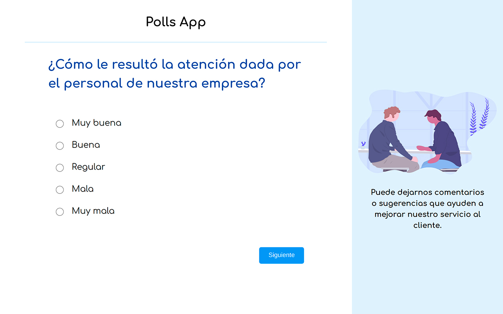
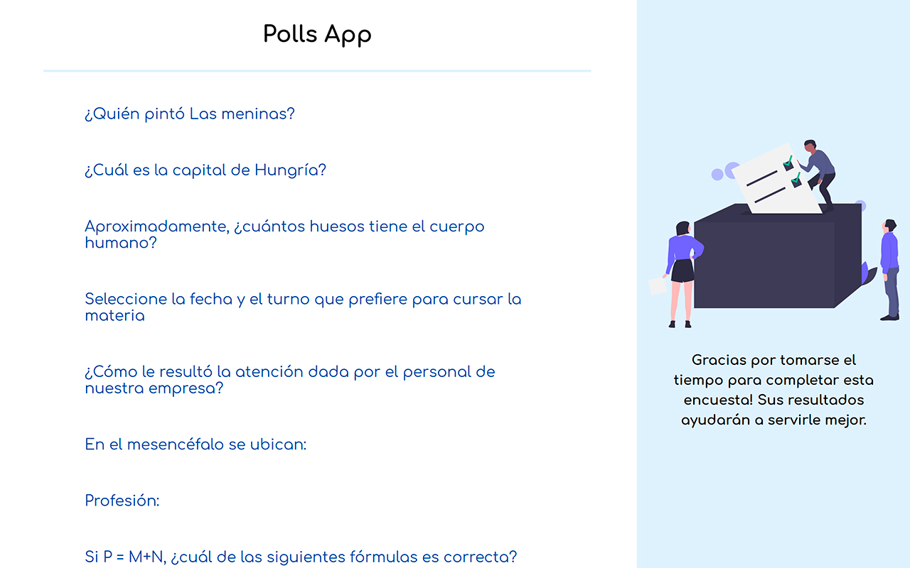
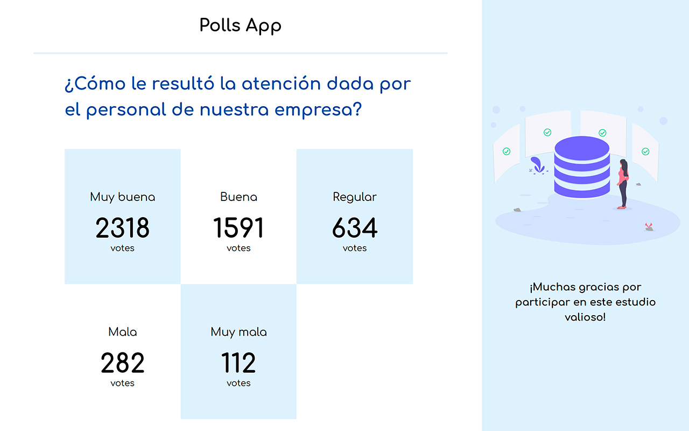

# Django Exercises

Building applications with django and jinja2. Creating microservices with the django rest framework.

# Content

- CRUD with django-rest-framework
- Image uploading and processing
- Django templates with bootstrap 
- Authentications and users
- Store application
- Forms handling

# Screenshots

# Running the app
Clone/download the project and run `pip install -r requirements.txt` to build the dependencies the project needs.

## Development
Run `python3 manage.py runserver` for a dev server. Navigate to `http://localhost:8000/`

# License
Released under the  [MIT licensed](LICENSE).\
Feel free to fork this project and improve it. Give a ⭐️ if you like this project!